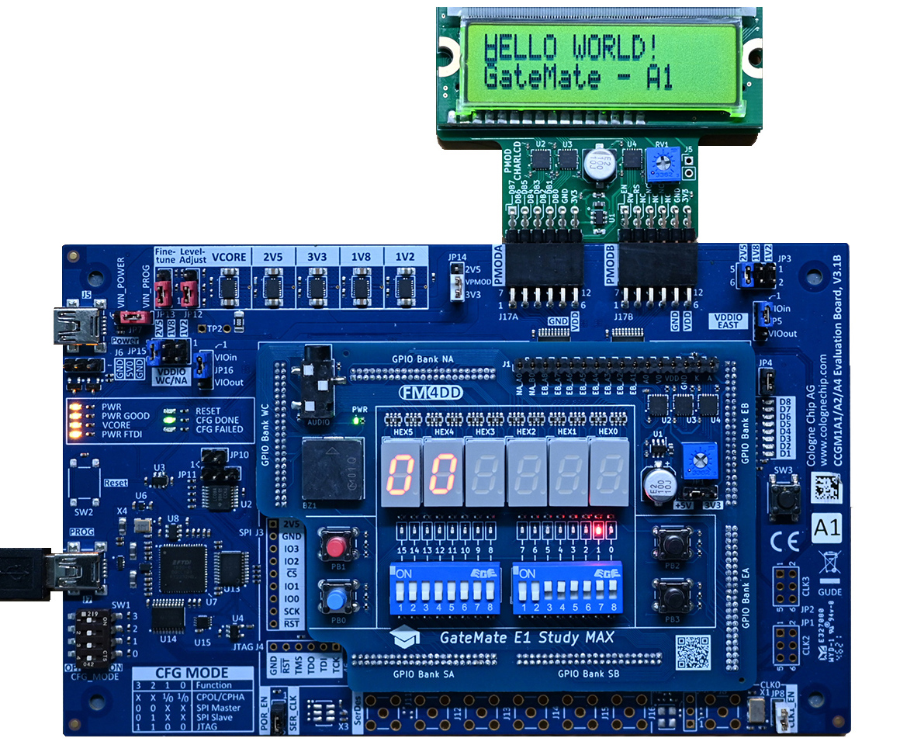

## PMOD-CharLCD Example "display" on Gatemate-E1

This Verilog example program displays the string "Hello World! Gatemate A1" on the PMOD-CharLCD module equipped with a Sunlike 16x2 character LCD. The PMOD module is connected to a Gatemate E1 board through PMOD connectors PMODA (J17A) and PMODB (J17B). The serial clock is derived from the 10MHz system clock of the evaluation board.

### Usage

```
fm@nuc7vm2204:~/fpga/hardware/pmod-charlcd/examples/gatemate/display$ make all
/home/fm/cc-toolchain-linux/bin/yosys/yosys -ql log/synth.log -p 'read -sv src/debounce.v src/display.v src/hexdigit.v src/lcd_transmit.v; synth_gatemate -top display -nomx8 -vlog net/display_synth.v'
/home/fm/cc-toolchain-linux/bin/p_r/p_r -i net/display_synth.v -o display -ccf ../gatemate.ccf > log/impl.log
/usr/local/bin/openFPGALoader  -b gatemate_evb_jtag display_00.cfg
Jtag frequency : requested 6.00MHz   -> real 6.00MHz
Load SRAM via JTAG: [==================================================] 100.00%
Done
Wait for CFG_DONE DONE
```

### Example



The program, executed under a Digilent Analog Discovery 2 logic analyzer:

