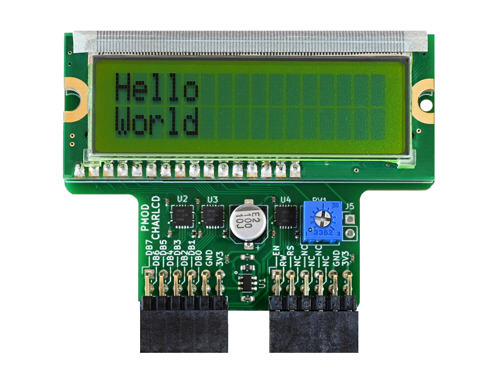
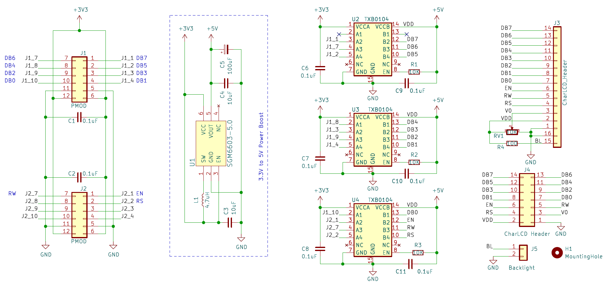
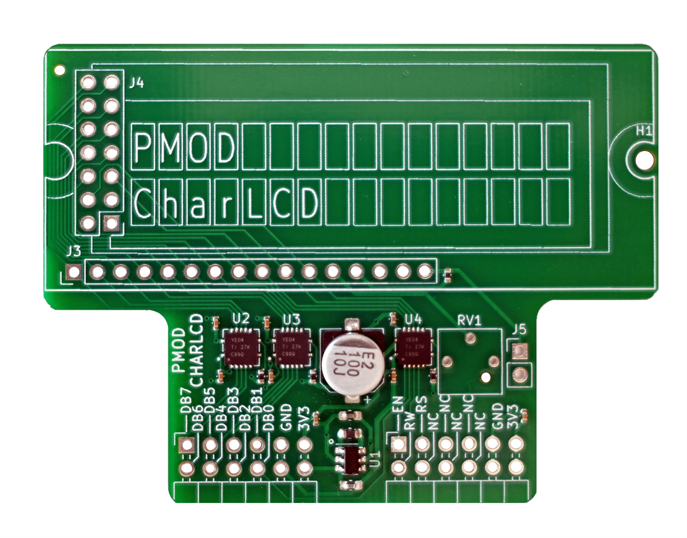
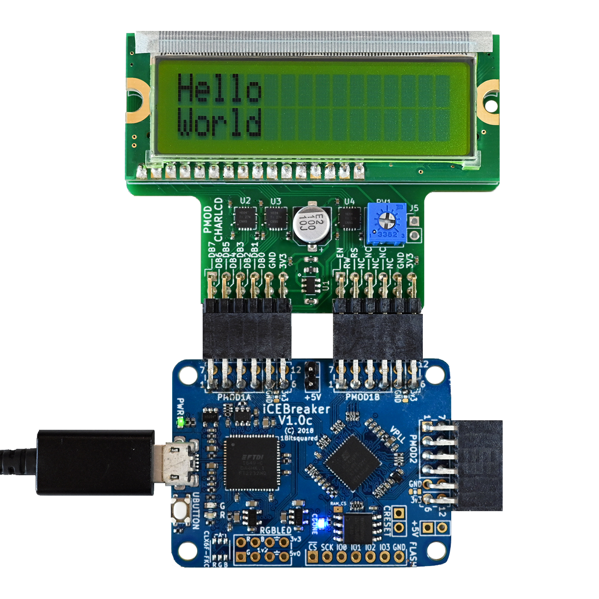
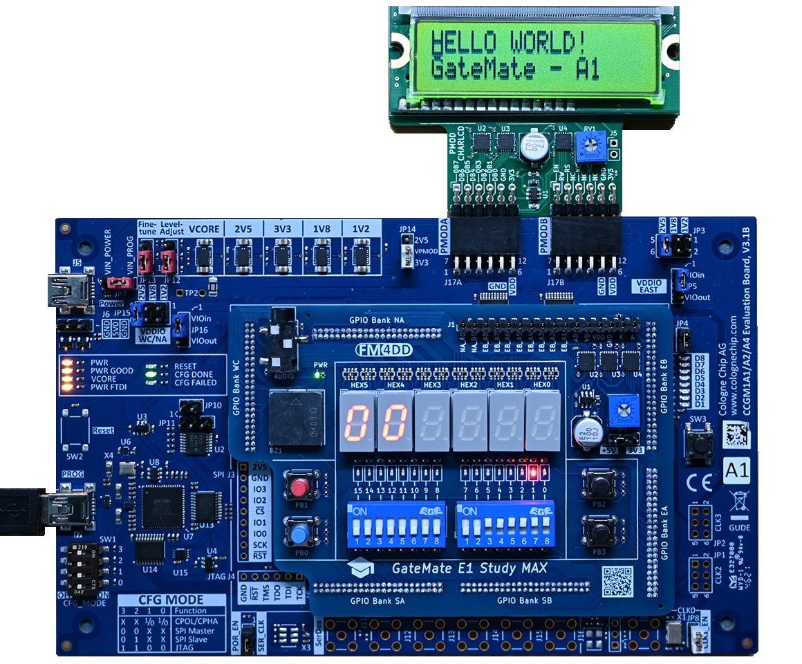

## CharLCD PMOD

### Description

This PMOD interfaces a HD44780-compatible 5V character LCD module via two PMOD connectors. This design connects all 8 data signal lines, and allows to run the LCD in both 4-bit and 8-bit mode. The build-in level converter boosts the 3.3V PMOD power and signal levels to 5V. Its physical size matches LCD modules types such as the Sunlike HUOB-XA-G-G. The additional 7x2 socket can interface with LCD displays using the 7x2 dual-row connector type. The resistor RV1 controls the contrast.

http://fpga.fm4dd.com/

### Schematic

### PCB Gerber

| Version | Gerber | Schema |
|---------|--------|--------|
| 1.0     |[20221207-pmod-charlcd-gerber.zip](fabfiles/v10/20221207-pmod-charlcd-gerber.zip) | [20221207-pmod-charlcd-schema.pdf](fabfiles/v10/20221207-pmod-charlcd-schema.pdf) |

### Pin Assignments

#### IceBreaker v1.0

 J21 |	Label |	Description   |	PMOD1A | J22 |	Label |	Description   | PMOD1B
-----|--------|---------------|--------|-----|--------|---------------|--------
1    |	d[7]  |	LCD Data-7    | 4      |1    |	en    |	LCD EN Signal | 43
2    |	d[5]  |	LCD Data-5    | 2      |2    |	rs    |	LCD RS Signal | 38
3    |	d[3]  |	LCD Data-3    | 47     |3    |	-     |	Not connected | 34
4    |  d[1]  |	LCD Data-1    | 45     |4    |  -     | Not connected | 31
7    |	d[6]  |	LCD Data-6    | 3      |7    |	rw    |	LCD RW Signal | 42
8    |	d[4]  |	LCD Data-4    | 48     |8    |	-     |	Not connected | 36
9    |  d[2]  |	LCD Data-2    |	46     |9    |  -     | Not connected | 32
10   |  d[0]  |	LCD Data-0    |	44     |10   |  -     |	Not connected | 28

### Code Examples

| Board                               | Description                                                       |
|-------------------------------------|-------------------------------------------------------------------|
| [iCEBreaker](examples/icebreaker)   | CharLCD Verilog demo for the iCEBreaker FPGA (Lattice ICE40UP5K)  |
| [Gatemate E1](examples/gatemate) | CharLCD Verilog demo for the Gatemate FPGA (Gatemate CCGM1A1)  |

### Board Pictures

CharLCD PMOD, connected to the iCEBreaker board.

CharLCD PMOD, connected to the Gatemate E1 board.

